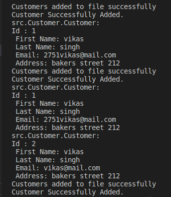
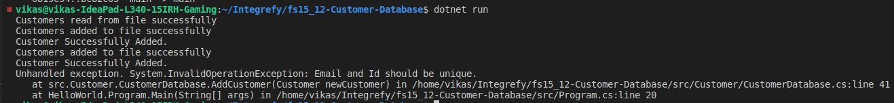
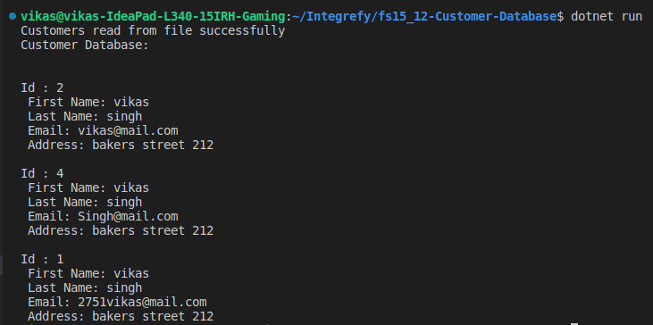
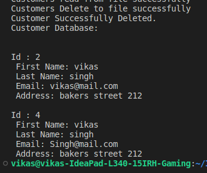
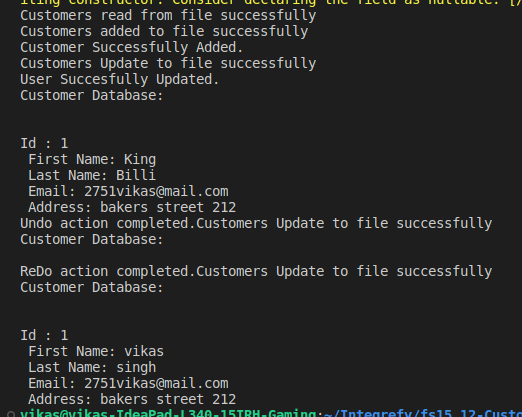
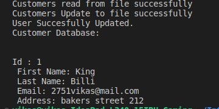

# Customer Database Management

You are tasked with building a customer database application that can store and retrieve customer information. The application should allow users to add, update, delete, and search for customers using various criteria. In addition, the application should be designed to handle large amounts of data efficiently, so it should utilize appropriate data structures and algorithms.

## Installation

Use this command to install dependencies and run the program.

```bash
dotnet restore
dotnet run
```

## Usage

```c#
# creates 'newCustomer'
 Customer customer1 = new Customer(1, "vikas", "singh", "2751vikas@mail.com", "bakers street 212");

# creates 'customerDatabase Instance'
CustomerDatabase customerDatabase = CustomerDatabase.Instance();

# add 'Customer'
customerDatabase.AddCustomer(customer1);

# Update 'Customer'
customerDatabase.UpdateCustomer(customer3);

# Delete 'Customer'
customerDatabase.DeleteCustomer(customer1.Id);\

# Undo 'last action'
customerDatabase.UndoAction();

# Redo 'last action'
customerDatabase.UndoAction();

```

## Results







